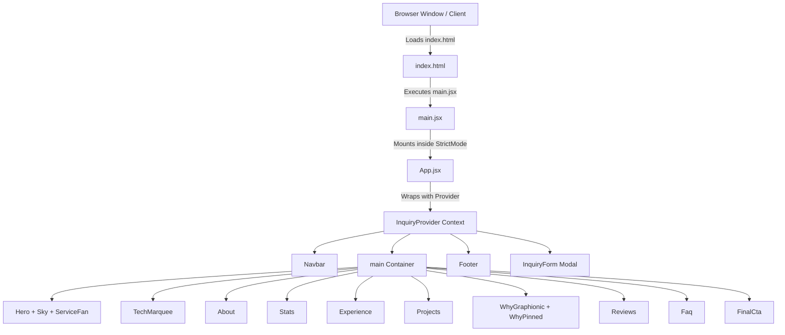
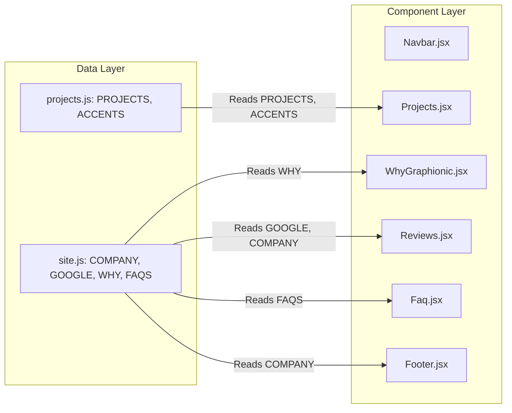

# Graphionic Infotech — System Architecture

## 1. Architecture Overview
This document establishes the authoritative system architecture for the **Graphionic Infotech** web application codebase.

The application is structured as a lightweight, high-performance **Single Page Application (SPA)** rendered entirely client-side using React 19 and bundled via Vite 8. It serves as the primary marketing and lead-generation portal for Graphionic Infotech, displaying company capabilities, service offerings, project showcases, verified client reviews, and interactive lead inquiry workflows.

---

## 2. System Goals
- **Performance & Zero Latency:** Maintain instantaneous initial paint and fast sub-second interactive loads via minimal bundle overhead, vector-based SVG graphics, and lazy asset loading.
- **Visual & Motion Consistency:** Provide smooth scroll-triggered entrances and sticky interactive reveals via Framer Motion without blocking main-thread UI rendering.
- **Maintainability & Data Decoupling:** Keep content (portfolio, FAQs, facts) strictly isolated in dedicated data collection files (`data/site.js`, `data/projects.js`) so non-technical stakeholders or future AI agents can update content without modifying component logic.
- **Security & PII Hygiene:** Ensure zero client-side leakage of sensitive user data or API secrets, with strict validation trust boundaries.

---

## 3. Technology Stack
- **UI Core:** React 19 (`react` `^19.2.8`, `react-dom` `^19.2.8`)
- **Build System & Dev Server:** Vite 8 (`vite` `^8.2.2`, `@vitejs/plugin-react` `^6.1.0`)
- **Scripting & Syntax:** Modern JavaScript (ES2022+ Modules, JSX)
- **Styling Architecture:** Vanilla CSS (`site/src/index.css`) with CSS custom properties (`:root` tokens)
- **Iconography:** Lucide React (`lucide-react` `^1.43.0`)
- **Animation System:** Framer Motion (`framer-motion` `^13.2.0`)
- **Linting & Code Hygiene:** Oxlint (`oxlint` `^1.79.0`)
- **Runtime Environment:** Node v18+ (tested on Node v26.4.0, npm 11.17.0)

---

## 4. Runtime Architecture
The application runs as a static SPA served over HTTP/HTTPS:

```
[ Browser / Client Window ]
        │
        ▼ (Loads index.html)
[ Vite Entry: main.jsx ]
        │
        ▼ (Mounts <App /> inside StrictMode)
[ InquiryProvider Context (context/Inquiry.jsx) ]
        │
        ├── Navbar (Fixed Glassmorphic Header & Mobile Drawer)
        ├── main (Sequential Scroll Sections)
        │     ├── Hero + Sky + ServiceFan
        │     ├── TechMarquee
        │     ├── About
        │     ├── Stats
        │     ├── Experience
        │     ├── Projects
        │     ├── WhyGraphionic + WhyPinned (Mobile Scrubbed Track)
        │     ├── Reviews
        │     ├── Faq
        │     └── FinalCta
        ├── Footer
        └── InquiryForm (Modal Dialog Overlay)
```

---

## 5. Repository Architecture
The repository uses a single-folder root structure wrapping the core Vite application:

```
graphionic_landing/
├── package.json              # Monorepo wrapper scripts (npm run dev, npm run build, etc.)
├── package-lock.json         # Workspace lockfile
├── README.md                 # Root repository overview
├── docs/                     # Engineering documentation suite
│   ├── README.md             # Documentation index & reading order
│   ├── project-handover-summary.md  # 5-minute developer quickstart
│   ├── system-architecture.md       # Authoritative technical architecture (this document)
│   ├── security-architecture.md     # Security audit, findings & headers configuration
│   ├── design-system.md             # Reverse-engineered design system & tokens
│   └── knowledge-transfer.md        # Comprehensive technical baseline report
├── uploads/                  # High-resolution design mockups & showcase assets
└── site/                     # Main Vite + React application
    ├── package.json          # App dependencies & scripts
    ├── package-lock.json     # App npm lockfile
    ├── vite.config.js        # Vite config (host: '0.0.0.0', port: 5173)
    ├── index.html            # Main HTML document template
    ├── public/               # Public static folder (favicon.svg, /projects/ screenshots)
    └── src/                  # Source codebase
        ├── main.jsx          # React DOM root entry
        ├── App.jsx           # Layout composition root
        ├── index.css         # Complete 1736-line global stylesheet
        ├── context/          # React context providers (Inquiry.jsx)
        ├── hooks/            # Custom React hooks (useIsMobile.js)
        ├── data/             # Static data arrays (site.js, projects.js)
        ├── assets/           # Internal graphic assets (hero.png, react.svg)
        └── components/       # UI sections & modal components
```

---

## 6. Layered Architectural Classification

### 1. Presentation Layer (`src/components/`)
Renders the visual interface, handles user events, triggers scroll animations, and presents interactive UI views.
- **Section Components:** `Hero.jsx`, `TechMarquee.jsx`, `About.jsx`, `Stats.jsx`, `Experience.jsx`, `Projects.jsx`, `WhyGraphionic.jsx`, `Reviews.jsx`, `Faq.jsx`, `FinalCta.jsx`, `Footer.jsx`.
- **Specialized Animation & SVG Views:** `Sky.jsx`, `ServiceFan.jsx`, `ServicePreviews.jsx`, `WhyPinned.jsx`.
- **Unmounted Feature Components:** `Services.jsx` (available for alternate layout configurations).

### 2. Application Layer (`src/App.jsx`, `src/context/`, `src/hooks/`)
Manages component hierarchy, global modal state, scroll listeners, and responsive breakpoint detection.
- `App.jsx`: Main section layout pipeline.
- `Inquiry.jsx`: Modal state provider (`open`, `openInquiry`, `closeInquiry`) & `scrollToId` window scroll offset helper.
- `useIsMobile.js`: Viewport media query listener (default max: `720px`).

### 3. Data Layer (`src/data/`)
Serves as the single source of truth for static site copy, portfolio projects, and configuration facts.
- `site.js`: `COMPANY`, `GOOGLE`, `WHY`, `FAQS`.
- `projects.js`: `PROJECTS` (array of portfolio items with `name`, `image`, `category`, `description`, `tech`, `url`, `accent`), `ACCENTS` color map.

### 4. Integration Layer (External Links & Boundaries)
- External outbound anchor links to Google Maps/Reviews and live client project URLs (`rel="noopener noreferrer"`).
- Future Lead API boundary in `InquiryForm.jsx` (`/api/inquiry`).

### 5. Asset Layer (`public/`, `src/assets/`)
- Public 16:10 ratio project screenshots (`public/projects/*.jpg`).
- Public favicons and icon SVG sprites.

### 6. Style Layer (`src/index.css`)
- CSS Custom Properties (`:root` tokens for colors, radii, shadows, page width).
- Global element styles, layout containers (`.shell`, `.page`), navigation classes (`.nav`, `.is-stuck`), component section styles, and responsive `@media` query blocks.

### 7. Build Layer
- Vite 8 bundling pipeline (`vite build`), Oxlint static analysis (`oxlint`).

---

## 7. Component Architecture & Responsibility Matrix

| Component | Responsibility | Dependencies | State | Props | Data Source | Styling Source | Risk / Scope |
| :--- | :--- | :--- | :--- | :--- | :--- | :--- | :--- |
| **`Navbar.jsx`** | Sticky floating header, brand logo, desktop menu, CTA button, mobile drawer | `framer-motion`, `lucide-react`, `Inquiry.jsx` | `open`, `stuck`, `onLight`, `active` | None | `LINKS`, `MOBILE_LINKS` | `.nav`, `.is-stuck`, `.mobile-menu` | ⚠️ HIGH (Header scroll thresholds) |
| **`Hero.jsx`** | Hero title, copy, CTA triggers, Sky background, ServiceFan | `framer-motion`, `lucide-react`, `Sky.jsx`, `ServiceFan.jsx`, `Inquiry.jsx` | None | None | Hardcoded copy text | `.hero`, `.hero-h1`, `.hero-ctas` | 🟢 LOW (Copy & CTA updates safe) |
| **`Sky.jsx`** | Procedural SVG animated vector cloud background | Native SVG elements | None | None | Internal SVG definitions | `.hero-sky`, `#haze` | 🟢 LOW (Pure graphical element) |
| **`ServiceFan.jsx`** | 7-card desktop arc fan & mobile infinite sliding carousel | `framer-motion`, `lucide-react`, `ServicePreviews.jsx` | `paused`, `manual` | None | `SERVICES` array | `.fan`, `.svc`, `.fan-scroll` | 🟡 MEDIUM (Arc geometry `GEO`) |
| **`ServicePreviews.jsx`**| Miniature vector SVG UI previews for service cards | Native SVG elements | None | None | Internal SVG canvases | `.svc-prev-svg` | 🟢 LOW (Pure graphical views) |
| **`Services.jsx`** | Alternate horizontal carousel section (unmounted in App) | `framer-motion`, `lucide-react`, `ServiceFan.jsx` | None | None | `SERVICES` array | `.services`, `.srv-track` | 🟢 LOW (Currently unmounted) |
| **`TechMarquee.jsx`** | Continuous infinite horizontal ticker of technology icons | Native SVG elements | None | None | `TECH` array | `.tech`, `.marquee`, `.marquee-row` | 🟢 LOW (Safe to add tech icons) |
| **`About.jsx`** | Company positioning statement & Global Presence badge | `framer-motion`, `lucide-react` | None | None | Hardcoded text copy | `.about`, `.globe-badge` | 🟢 LOW (Safe to adjust text) |
| **`Stats.jsx`** | 4 key performance metric cards (100+ Projects, 100% Speed, etc.) | `framer-motion`, `lucide-react`, `useIsMobile.js` | None | None | Hardcoded metrics & `AV` gradients | `.stats`, `.stat`, `.stat--blue` | 🟢 LOW (Metrics safe to update) |
| **`Experience.jsx`** | 7+ Years engineering banner with rotating 3D dot-globe SVG | `framer-motion`, `lucide-react` | None | None | Hardcoded copy text | `.exp-wrap`, `.exp`, `.exp-globe` | 🟡 MEDIUM (SVG globe lattice math) |
| **`Projects.jsx`** | Portfolio case study grid showcase with project links | `framer-motion`, `lucide-react`, `projects.js`, `Inquiry.jsx` | None | None | `PROJECTS`, `ACCENTS` (`data/projects.js`) | `.projects`, `.prj-grid`, `.prj` | 🟢 LOW (Data-driven portfolio) |
| **`WhyGraphionic.jsx`**| 4-card differentiator section & mobile WhyPinned wrapper | `framer-motion`, `lucide-react`, `site.js`, `WhyPinned.jsx`, `useIsMobile.js` | None | None | `WHY` (`data/site.js`) | `.why`, `.why-grid`, `.why-card` | 🟡 MEDIUM (Tightly tied to WhyPinned) |
| **`WhyPinned.jsx`** | Sticky 300vh scroll-scrubbed card pin controller on mobile | `framer-motion` | None | `items` | Parent JSX nodes | `.whyp`, `.whyp-stage`, `.whyp-grid` | ⚠️ HIGH (Mobile sticky scroll math) |
| **`Reviews.jsx`** | Google Business rating breakdown & verified reviews banner | `framer-motion`, `lucide-react`, `site.js` | None | None | `GOOGLE`, `COMPANY` (`data/site.js`) | `.reviews`, `.rev-badge`, `.rev-stats` | 🟢 LOW (Rating stats safe to update) |
| **`Faq.jsx`** | Interactive Q&A accordion list & contact sidebar | `framer-motion`, `lucide-react`, `site.js`, `Inquiry.jsx`, `useIsMobile.js` | `open` | None | `FAQS`, `PERKS` (`data/site.js`) | `.faq`, `.faq-layout`, `.faq-item` | 🟢 LOW (Q&A entries data-driven) |
| **`FinalCta.jsx`** | Conversion banner with dot-globe SVG and project steps card | `framer-motion`, `lucide-react`, `Inquiry.jsx` | None | None | `PERKS`, `STEPS` | `.cta-wrap`, `.cta`, `.cta-card` | 🟢 LOW (Conversion CTA text safe) |
| **`Footer.jsx`** | Global site footer with brand, navigation, services, & contact | `lucide-react`, `site.js`, `Inquiry.jsx` | None | None | `COMPANY` (`data/site.js`), `NAV`, `SERVICE_LINKS` | `.foot`, `.foot-grid`, `.foot-bar` | 🟢 LOW (Footer links safe) |
| **`InquiryForm.jsx`**| Lead generation modal dialog with field validation & submission | `framer-motion`, `lucide-react`, `Inquiry.jsx`, `site.js` | `form`, `errors`, `state` | None | `PROJECT_TYPES`, `BUDGETS`, `EMPTY` | `.inq-backdrop`, `.inq`, `.inq-form` | 🟡 MEDIUM (Form validation logic) |

---

## 8. Target Directory & Dependency Rules

### Target Architecture Structure
```
site/src/
├── components/          # Compound section views (Hero, Navbar, Footer, Projects, etc.)
├── ui/                  # (Future) Atomic UI primitives (Button, Input, Badge, Modal)
├── context/             # React Context providers (Inquiry.jsx)
├── hooks/               # Custom hooks (useIsMobile.js)
├── data/                # Content data collections (site.js, projects.js)
├── services/            # (Future) API HTTP client services (inquiryApi.js)
├── utils/               # Shared helpers (smooth scroll, formatters)
├── assets/              # Internal static images & SVGs
└── styles/              # Design tokens & CSS styles (index.css)
```

### Dependency Direction Rules
1. **UI Components / Atomic Views** → Used by **Sections**.
2. **Sections** → Composed inside **`App.jsx`**.
3. **Data Files (`data/*.js`)** → Read by **Sections & Components**. Components must not mutate static data files.
4. **Contexts & Hooks (`context/`, `hooks/`)** → Consumed by **Components**.
5. **Services (`services/`)** → Called by **Form Components / Async Handlers** to interface with external APIs.
6. **No Component Secrets:** Components must NEVER contain API credentials, private tokens, or hardcoded server keys.

---

## 9. Architecture Diagrams

### System Overview Diagram


### Data Flow Diagram


### Inquiry Lead Flow Diagram
```mermaid
graph TD
    User[User Clicks CTA Button] -->|Triggers openInquiry()| Context[InquiryContext]
    Context -->|Sets open: true| Modal[InquiryForm Modal Rendered]
    Modal -->|User Fills Form| Input[Name, Email, Phone, Type, Budget, Details]
    Input -->|User Clicks Submit| Validation{Client-Side Validation}
    Validation -->|Errors Found| Highlight[Highlight .has-error & Show Error Text]
    Validation -->|Valid Payload| Sending[Set state: sending]
    Sending -->|Future Async API Call| Boundary[POST /api/inquiry Boundary]
    Boundary -->|Response Success| Done[Set state: done -> Show Thank You Screen]
```

---

## 10. safe Extension Patterns & Anti-Patterns

### Safe Extension Patterns
- **Adding Portfolio Items:** Append a new entry object to `PROJECTS` in `src/data/projects.js` and drop the corresponding 16:10 screenshot into `site/public/projects/`. The grid will adapt automatically without component edits.
- **Updating FAQs:** Append or edit question/answer objects in `FAQS` inside `src/data/site.js`.
- **Modifying Company Information:** Edit `COMPANY` or `GOOGLE` objects in `src/data/site.js`.

### Anti-Patterns (Do NOT Do)
- ❌ **Do NOT hardcode content in JSX:** Avoid inserting raw text copy or client metrics directly into component files. Use `src/data/`.
- ❌ **Do NOT break sticky scroll containers:** Do NOT add `overflow: hidden` to parent section elements above `.why` / `WhyPinned.jsx`, as it breaks `position: sticky` on iOS WebKit.
- ❌ **Do NOT import heavy libraries:** Do NOT install GSAP or alternative animation engines alongside Framer Motion.
- ❌ **Do NOT log PII to browser console:** Never log user form inputs, emails, or phone numbers using `console.log` or `console.info`.
